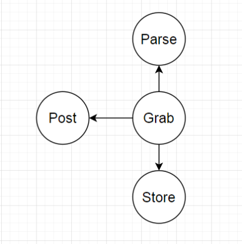

# Проект "Grabber Java Vacancies"

* [Описание](#описание)
* [Технологии](#технологии)
* [Архитектура](#архитектура)
* [Результат работы](#результат)
* [Документация JavaDoc](#javadoc)
* [Тесты](#тесты)
* [Автор](#автор)
* [Критика и предложения](#критика_и_предложения)

## Описание
Приложение парсит Java-вакансии с сайта sql.ru в базу данных PostgreSql.
Архитектура позволяет расширить его для парсинга
вакансий с других сайтов.

## Технологии
В проекте используются следующие технологии:
- Postgresql в качестве хранилища данных
- JDBC для коннекта к БД
- Jsoup для парсинга
- Quartz для периодизации работы

## Архитектура

Проект делится на слои:
1. Хранилище (интерфейс [Store](src/main/java/ru/job4j/grabber/Store.java)).
Отвечает за хранение вакансий.
В проекте на данный момент есть только одна рабочая реализация: 
[PsqlStore](src/main/java/ru/job4j/grabber/PsqlStore.java),
сохраняющая вакансии в базу данных PostgreSQL.
    1.1 Модель данных для вакансии - [Post](src/main/java/ru/job4j/grabber/Post.java)
2. Парсер ресурса с вакансиями (интерфейс [Parse](src/main/java/ru/job4j/grabber/Parse.java))
Отвечает за парсинг вакансий с какого-либо ресурса
и преобразование их в модель данных Post.
В данном проекте на данный момент есть лишь одна 
рабочая реализация: [SqlRuParse](src/main/java/ru/job4j/grabber/SqlRuParse.java) -
которая реализует парсинг вакансий с сайта sql.ru
3. Контроллер [Grabber](src/main/java/ru/job4j/grabber/Grabber.java), 
объединяет все части приложения, инициализирует все необходимые объекты
и запускает парсинг. Внутри использует библиотеку Quartz для периодизации
работы.
    
## Результат
В результате парсинга с сайта Sql.ru
получено 3102 вакансии.
[Скачать csv](https://drive.google.com/file/d/10HOySrIpI0Fb6IvOcmBqHVw-jnN3FQ-G/view?usp=sharing)

## JavaDoc
TODO

## Тесты
Написаны модульные тесты, а так же интеграционные
тесты с применением технологии Liquibase

## Автор

Гераськин Егор Владимирович

Java-разработчик

yegeraskin13@gmail.com

+79271506651

## Критика_и_предложения
Все замечания и пожелания по этому проекту просьба направлять мне 
на электронный адрес: yegeraskin13@gmail.com

